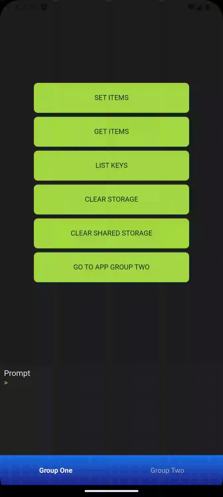

# Eitri Developer Overview

## Release - 24/02/2025

## Sobre a release

A release do dia 24/02/2025 atualiza a Eitri Machine no Android para o targetSdk 34, que equivale à versão 14 do SO. Com isso, a machine terá compatibilidade a novos recursos do Android!
Uma série de novas funcionalidades também foram disponibilizadas ao desenvolvedor, como listagem e remoção de notificações agendadas, suporte para chamadas à telas e serviços nativos ao executar um eitri-app, funções de reload de um eitri-app e simulação de bottom bar no Eitri Play para desenvolvimento de múlitplos workspaces.
Uma série de correções também foi feita para melhorar a qualidade dos eitri-apps, como a eliminação de um memory leak no uso da bottom bar e a correção de modal de confirmação no Eitri Doctor.

---

## Eitri Machine v.3.3.0

### Novas features

#### Suporte para chamadas de serviços e componentes na execução de um Eitri-App

No Android, agora o modelo `RunInput` tem a propriedade `#!kotlin intentFlags: Int?`, permitindo que se chame uma tela ou serviço nativo ao executar um eitri-app

#### Listagem e cancelamento de notificações agendadas

Agora é possível listar e remover as notificações que foram agendadas por `#!js async Eitri.notification.sendLocalPush()`. Isso é feito através de dois novos métodos, `#!js async Eitri.notification.listLocalPushes(): Promise<NotificationSchedules>` e `#!js async Eitri.notification.cancelLocalPush(): Promise<void>`.
Um exemplo de utilização de listLocalPushes é como tal:

```js
let localPushes = await Eitri.notification.listLocalPushes();
console.log(localPushes);

/* Example output from this console.log:
{
  schedules: [
    { nextOccurrence: "Feb 14, 2025 4:07:58 PM", notification: {...} },
    { nextOccurrence: "Feb 15, 2025 10:00:00 AM", notification: {...} }
  ]
}
*/
```

Já `cancelLocalPush` é usado da seguinte forma:

```js
await Eitri.notification.cancelLocalPush({ id: "1" });
```

#### Reload de eitri-app

Foi adicionada a funcionalidade de recarregar um eitri-app, acessada através do método `#!js async Eitri.navigation.reload(): Promise<void>`.

#### Simulação de bottom bar

O Eitri Play agora pode simular bottom bars para ajudar no desenvolvimento com múltiplos workspaces.



### Correções

#### Memory Leak nas bottom bars

Foi corrigido um memory leak que afetava as views de bottom bar no Android.

#### Bottom bar para de funcionar após longo tempo em execução

Foi corrigido um erro presente apenas no iOS que fazia com que a bottom bar deixasse de abrir e fechar após um longo tempo de execução do eitri-app devido à problemas com gerenciamento da RAM.

#### Corrige lógica de modal de confirmação do Eitri Doctor

Corrige lógica do componente `PrompModal.jsx` no Eitri Doctor para que ele passe a abrir.

---

## Eitri Play

### Atualizações

Nova versão do Eitri Play passa a vir com a Eitri Machine atualizada para a versão 3.3.0.

---

## Luminus v.X.X.X

### Novas features

#### Carregamento "on demand" de imagens que usam lazy loading

As tags `#!jsx <ImageView>` e `#!jsx <Image>` agora possuem um atributo `loading`, que aceita um valor ondemand que força o carregamento da imagem.
Por exemplo:

```jsx

<Image
    src={img}
    loading="ondemand"
    width="100%"
    dataCy="image-width"
    marginBottom="small"
/>

```

```jsx

[1, 2, 3, 4, 5].map((index) => (
    <ImageView
      loading="ondemand"
      width="20%"
      aspectRatio="1:1"
      key={"image_${index}"}
      src={"http://lorempixel.com.br/800/800/?${index}"}
      borderRadius="pill"
      borderWidth="hairline"
	/>
))

```

---
